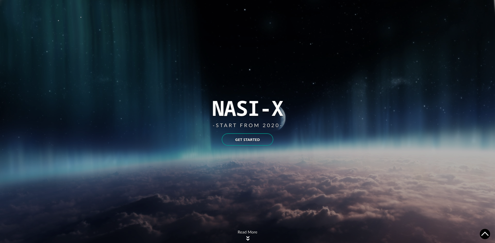
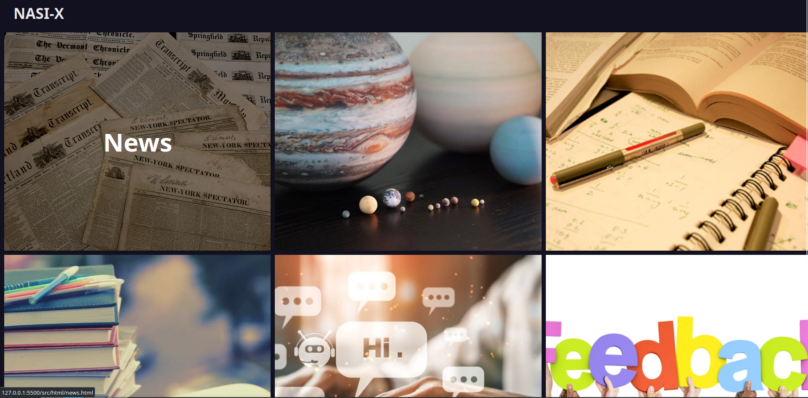
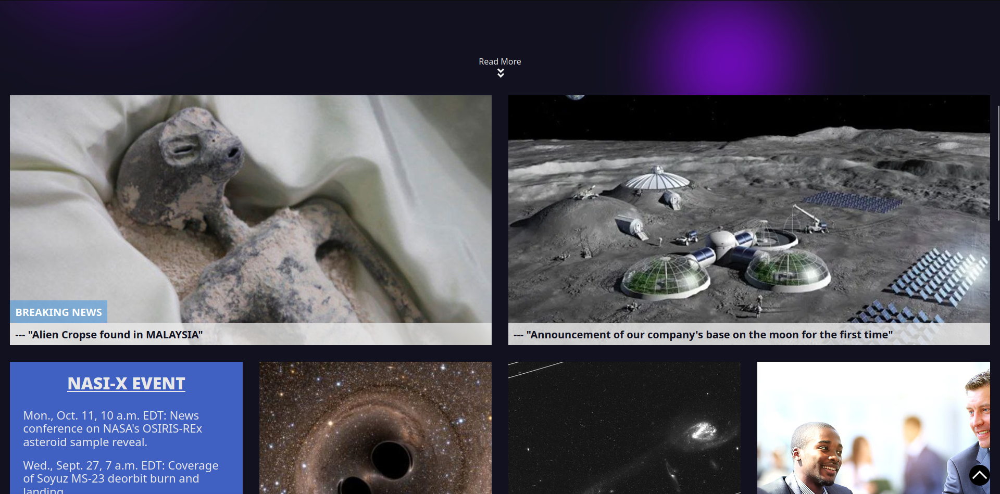
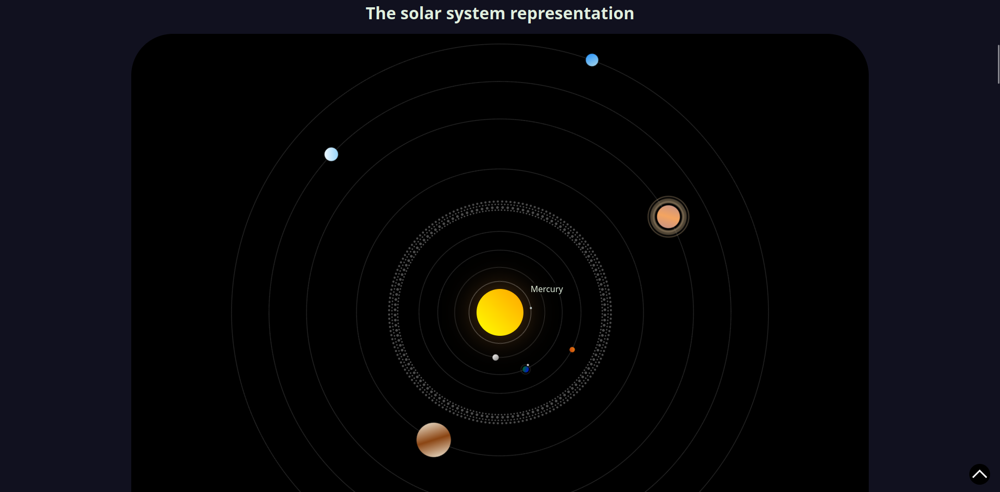
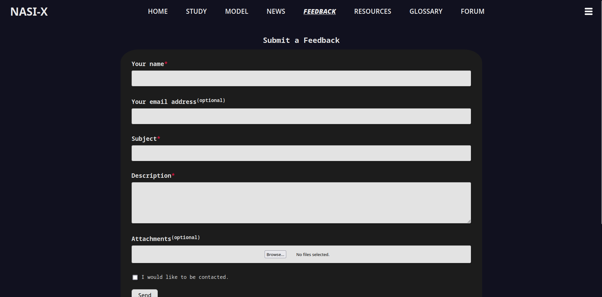
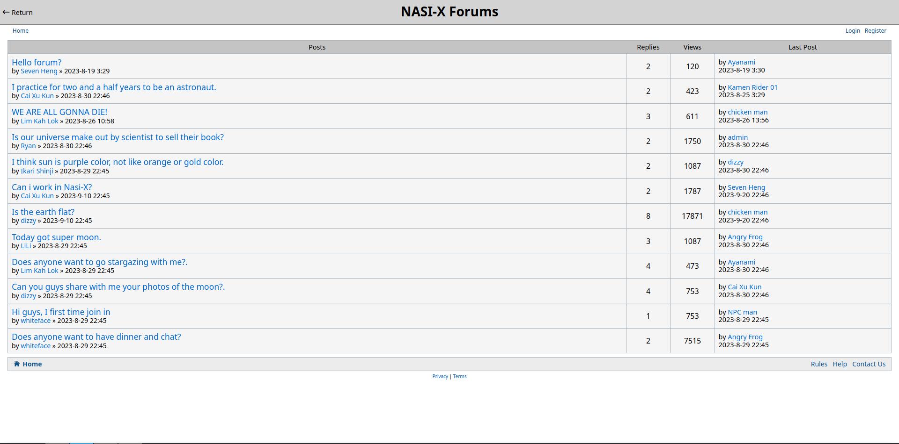
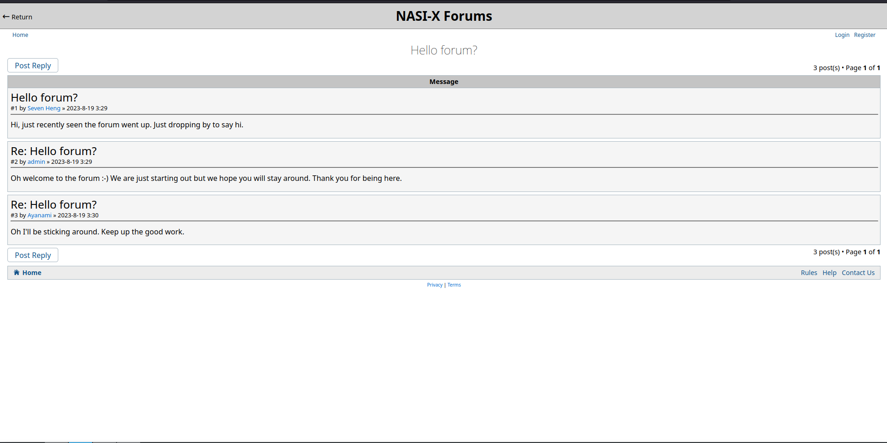

NASI-X
======

A small website for everything space and space-related. Taken heavy inspiration from NASA.

Done as a group assignment for the Web Design course in college.

## Disclaimer

This project have no relation with NASA or any entities of that matter, and all the information presented may be misleading and misinformative. It's just a funny college assignment project.

## Showcase

### Home

### News

### Solar System

### Feedback

### Forum

